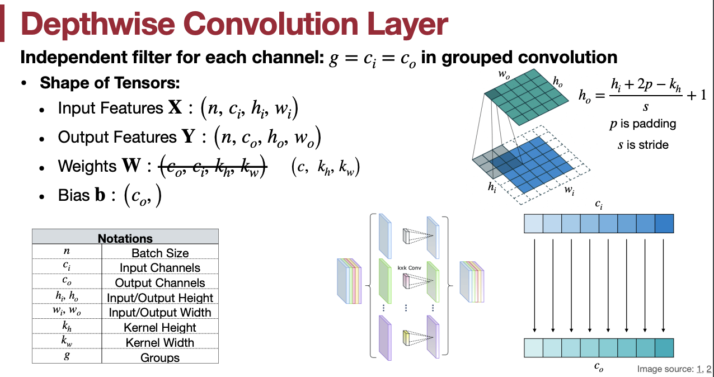
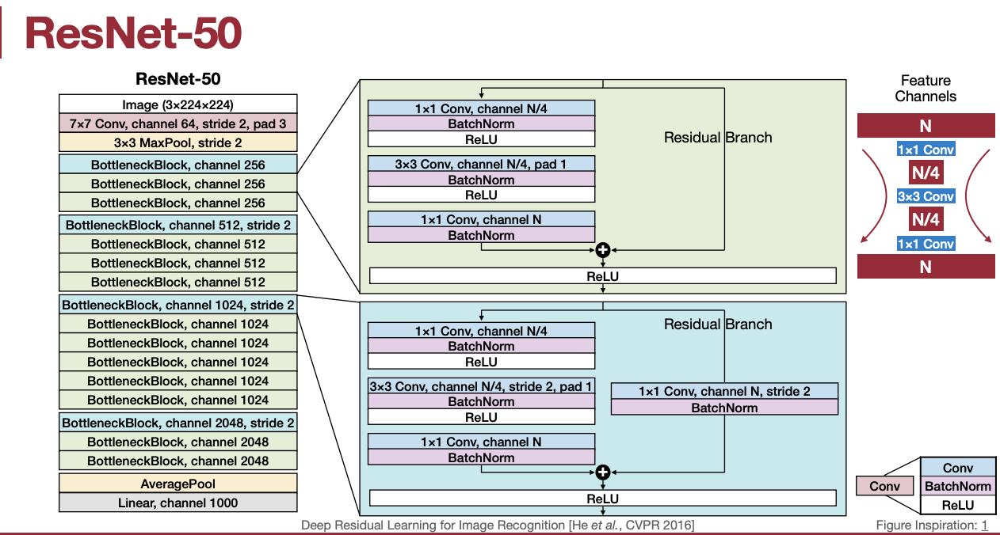
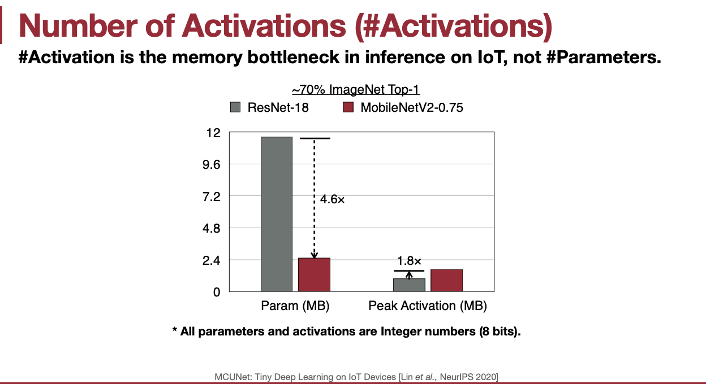
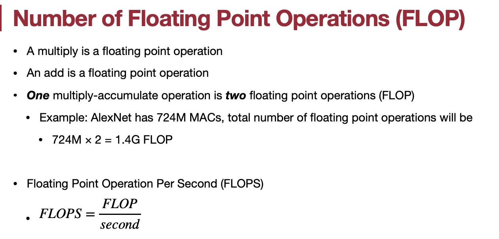
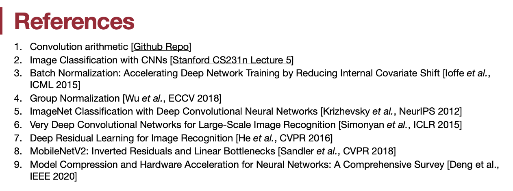

## Lecture 02: Basics of Neural Networks

| Title       | Basics of Neural Networks                                    |
| ----------- | ------------------------------------------------------------ |
| Lecturer    | Song Han                                                     |
| Date        | 09/13/2022                                                   |
| Note Author | Guangxuan Xiao (xgx)                                         |
| Description | Review the basics of deep learning and introduce efficiency metrics for neural networks. |

回顾深度学习的基础知识，介绍神经网络的效率度量。

> （第一讲没有视频资料，只有课件，所以我们直接从第二讲开始）
>
> 下面是官网 github 上的笔记，后面是课程视频的图文版本，机翻+少量人工注释

[TOC]


### 1. 术语表

突触（Synapses） = 权重（Weights） = 参数（Parameters: 神经网络中的连接强度）

神经元（Neurons）  = 特征（Features） = 激活（Activations: 神经网络中的输入/中间/输出值。）

### 2. 流行的神经网路层

#### 2.1 全连接层 (线性层)

输出神经元连接到所有输入神经元。$y_i = \sum_j w_{ij}x_j+b_i$, 这里的 $n$ 是批量的大小, $c_i$ 是输入通道数， $c_o$ 是输出通道数。

| Tensors      | Shapes       |
| ------------ | ------------ |
| 输入特征 $X$ | $(n, c_i)$   |
| 输出特征 $Y$ | $(n, c_o)$   |
| 权重 $W$     | $(c_o, c_i)$ |
| 偏置 $b$     | $(c_o, )$    |

#### 2.2 卷积层

输出神经元仅与感受野中的输入神经元相连。

| Tensors      | Shapes of 1-D Conv | Shapes of 2-D Conv     |
| ------------ | ------------------ | ---------------------- |
| 输入特征 $X$ | $(n, c_i, w_i)$    | $(n, c_i, h_i, w_i)$   |
| 输出特征 $Y$ | $(n, c_o, w_o)$    | $(n, c_o, h_o, w_o)$   |
| 权重 $W$     | $(c_o, c_i,k_w)$   | $(c_o, c_i, k_h, k_w)$ |
| 偏置 $b$     | $(c_o, )$          | $(c_o, )$              |

- 计算单个输出元素所需的乘法等于卷积核的大小。
- 如何计算输出高度和宽度？$h_o = h_i - k_h + 1$

##### 2.2.1 Padding

Padding 使输出特征图大小与输入特征图大小保持相同。

- 零填充用零填充输入边界。$h_o = h_i + 2p-k_h + 1$
  
- 其他: 反射填充，复制填充，常数填充等

##### 2.2.2 感受野

- 在卷积中，每个输出元素依赖于 $k_h \times k_w$ 个输入
- 每个连续层之间卷积将增加 $k-1$ 感受野大小。
- $L$ 层的感受野大小为为 $L(k-1)+1$

##### 2.2.3 跨步卷积层

跨步卷积层在不增加层的情况下增加了感受野。$h_o = \frac{h_i + 2p-k_h}{s}+1$, 这里的 $s$ 是步幅，$p$ 是指 padding 大小。

##### 2.2.4 分组卷积层

A **Grouped Convolution** uses a group of convolutions - multiple kernels per layer - resulting in multiple channel outputs per layer。这会使网络可以更宽，帮助网络学习各种各样的低级和高级特征。

权重 $W$ 的变化：$(c_o, c_i, k_h, k_w) \rightarrow (g \times c_o/g, c_i/g, k_h, k_w)$ 

##### 2.2.5 Depthwise 卷积层

每个通道是独立处理的，是分组卷积的极端化， $g= c_i = c_o$ 

权重： $(c, k_h, k_w)$

##### 2.2.6 其他卷积层

- 转置卷积可用于对特征图进行上采样（例如，在超分辨率和实例分割中）。

- 空洞卷积可用于增加具有扩张卷积核的感受野。

#### 2.3 池化层

池化层用于对特征图进行降采样，并逐渐减小特征图的大小。通常，步长与卷积核大小相同。

#### 2.4 归一化层

特征归一化可以使模型优化更快，归一化的公式如下：

$\hat{x}_i = \frac{x_i-\mu_i}{\sigma}$,

$\mu_i = \frac{1}{m}\sum_{i\in\delta_i}x_k$,

$\sigma_i=\sqrt{\frac{1}{m}\sum_{k\in\delta_i}(x_k-\mu_i)^2+\varepsilon}$

#### 2.5 激活函数

激活函数通常是非线性的：

- ReLU 是有效的，并且量化友好，但是对于负输入具有零梯度。

- GeLU、Swish 和 Hardswish 更有效，但难以量化。

#### 2.6 Transformers

Transformer 由多个自注意力层组成，这些层查找 token 之间的关系。自注意力的计算复杂性为 $O(n^2)$，其中 $n$ 是 token 大小。因此，对于大的 token 量，它将非常缓慢。

### 3. 流行的 CNN 架构

- AlexNet [[Krizhevsky *et al.*, 2012]](https://papers.nips.cc/paper/4824-imagenet-classification-with-deep-convolutional-neural-networks) 是第一个采用具有连续卷积层（conv3, 4, 5）结构的架构。

- ResNet [[He *et al.*, 2015]](https://arxiv.org/abs/1512.03385) 引入残差连接以允许梯度流动。

- MobileNetV2 [[Sandler *et al.*, 2018]](https://arxiv.org/abs/1801.04381) 引入 depthwise 卷积，有效降低计算成本。

### 4. 深度学习的效率指标

两个核心指标是**计算和内存**。

考虑的三个维度是**存储、延迟和能源**。

#### 4.1 延迟

$\text{Latency} = \max(T_{operation}, T_{memory})$

#### 4.2 能量消耗

内存访问比计算更耗能。以下是能耗排名：

DRAM 访问 > SRAM 访问 > 浮点乘 > 整形乘 > 寄存器文件 > 浮点加 > 整形加

因此，我们应该避免数据移动，因为数据移动越多，内存引用越多将导致更多的能耗。

#### 4.3 内存相关的指标

##### 4.3.1 参数量计算

- 线性层： $c_0 \times c_i$

- 卷积层： $c_o c_i k_h k_w$

- 分组卷积： $c_o c_i k_h k_w / g$

- Depthwise 卷积： $c_o k_w k_h$

##### 4.3.2 模型大小

- $\text{模型大小} = \text{参数量} \times {比特宽度}$

例如，AlexNet 有 61M 参数量，模型大小将是 244M（FP32）或者 61M（INT8）

##### 4.3.3 总的和峰值激活

- MobileNet 的不平衡内存分布：瓶颈分别是峰值（推断）和总和（训练）
- 训练瓶颈：不是参数量而是激活
- MCUNet：激活变少，参数变多，因为通道在增加，分辨率在降低。

#### 4.4 计算相关的指标

##### 4.4.1 MACs：乘法累加运算

乘法累加（MAC）操作为 $a=a+b \times c$。以下是一些常见操作的 MAC 数量：

- 矩阵-向量乘法(MV)： $m\times n$
- 一般的矩阵-矩阵乘法(GEMM)：m\times n\times k$
- 线性层： $c_o\times c_i$
- 卷积层： $c_i\times k_w \times k_h \times h_o \times w_o \times c_o$
- 分组卷积： $c_i\times k_w \times k_h \times h_o \times w_o \times c_o / g$
- Depthwise 卷积： $k_w \times k_h \times h_o \times w_o \times c_o$
- 作为示例，AlexNet 有 724M MACs.

##### 4.4.2 FLOP: 浮点操作

* 一个浮点乘法累加（MAC）操作对应于两个浮点操作（FLOP）：乘法和加法。

例如，AlexNet 有 724M MACs，对应有 1.4G FLOP.

- 每秒浮点运算 (FLOPS)
  
  $FLOPS = \frac{FLOP}{second}$


## Lecture 02 - Basics of Neural Networks

        

这就是我们的一些初步的东西，让我们进入第二讲，介绍关于神经网络的基础知识，这真的是为那些以前没有训练过神经网络的人准备的，对有了解的人也可以提供一些关于效率方面的见解，以及深度神经网络效率方面的一些关键指标测量等。

上一节课的快速总结，深度学习在视觉、语言和语音中无处不在。


对于深度学习，其性能最近几年更新的非常快，图像识别的错误度在过去 10 年里急剧下降。

对于文本翻译来说，我们希望将此类应用程序推送到移动设备而无需连接互联网。

我们还讨论了汽车的高效深度学习，自动驾驶，如何让工作站的整个主干正确等。

（视频网址：https://youtu.be/2CVInKMz9cA）


我们还谈到了游戏方面的深度学习，该游戏需要近 2000 个 cpu，300 个 gpus，每场比赛 需要 3000 美元电费，

AlphaFold 使用了 16 个 tpu 训练了几周时间


在本次讲座中，我们将首先回顾神经网络的术语，什么是神经元突触、激活函数、权重参数等，然后揭示神经网络中的流行构建块，包括全连接层、卷积层、分组卷积层，depthwise 卷积层，归一化层，以及 Transformers；

接下来我们将回顾那些卷积神经网络架构，包括 AlexNet、VGG、ResNet 50 和 MobileNet v2，

然后我们将介绍那些流行的效率指标，当构建一个小型紧凑的低成本神经网络，需要考虑的是什么 ，包括参数数量，模型大小，峰值激活大小，flop 和 flops，最后我们将为那些没有经验的人提供关于 pytorch 的现场教程。

\


第一节最后我们简要讨论了神经元和突触，突触有很多输入，然后我们乘以输入的权重，并将它们组合起来，并通过激活函数，输出一个信号到轴突；

这是一个三层神经网络的例子，有两个隐藏层，术语**突触、权重、参数意味着那些训练权重**，**神经元、特征、激活是同样的意思**，并且**对于突触，权重和参数是一样的意思**。


我们从介绍这些全连接层开始，也称为线性层，在这种情况下，输出神经元连接到所有输入神经元，我们想更深入地研究每种神经网络的维度体系结构，这对于学习高效的神经网络非常关键，因为我们要考虑处理激活的大小是多少，内存占用的大小是多少，我们必须执行的计算数量是多少等，所以维度是非常重要的，在这之后的所有讲座中，我们将弄清楚输入、输出特征、权重以及偏置的维度是多少。各特征、参数的维度及符号表示如图所示。

> **Shape：**
>
> - 输入：$(*, H_{in})$， 这里的 $*$ 意味着任意数量的维度，包括 none，$H_{in} = \text{in\_features}$.
> - 输出：$(*, H_{out})$，其中除最后一个维度外的所有维度都与输入的形状相同，即 $H_{out} = \text{out\_features}$
>
> **属性**：
>
> * weight：$(\text{out features},\text{in features})$ 。初始化：$\mathcal{U}(-\sqrt{k}, \sqrt{k})$，这里的 $k = \frac{1}{\text{in\_features}}$
> * bias：$(\text{out\_features})$。如果 True，初始化同上。
>
> ```python
> >>> m = nn.Linear(20, 30)
> >>> input = torch.randn(128, 20)
> >>> output = m(input)
> >>> print(output.size())
> torch.Size([128, 30])
> ```


一维卷积场景，例如语音识别，我们就有一个相当长的时间序列。

一维卷积基本上是通过执行每个元素的乘法和一些将它们加在一起并产生一个输出元素来计算的，你有多个这样的卷积核，例如黄色的卷积核产生黄色的输出，绿色的卷积核产生绿色的输出，并随着时间维度的窗口移动产生下一组空间值。各特征、参数的维度及符号表示如图所示。

> 你可以把通道维度理解为每个时间点的数据特征维度，可以把空间维度理解为语音信号的时间维度
>
> 输入：$(N, C_{in}, L_{in})$
>
> 输出：$(N, C_{out}, L_{out})$
>
> 其中，
> $$
> L_{out} = \left\lfloor\frac{L_{in} + 2 \times \text{padding} - \text{dilation}
>                         \times (\text{kernel\_size} - 1) - 1}{\text{stride}} + 1\right\rfloor
> $$
> 一维卷积的计算公式：
> $$
> \text{out}(N_i, C_{\text{out}_j}) = \text{bias}(C_{\text{out}_j}) +
>         \sum_{k = 0}^{C_{in} - 1} \text{weight}(C_{\text{out}_j}, k)
>         \star \text{input}(N_i, k)
> $$
> $N$ 是 batch 大小，$C$ 是通道数，$L$ 是信号序列长度，$*$ 是 Cross-correlation 运算，可以理解为卷积，具体解释参见：https://en.wikipedia.org/wiki/Cross-correlation
>
> **属性：**
>
> * weight：$(\text{out\_channels},
>                 \frac{\text{in\_channels}}{\text{groups}}, \text{kernel\_size})$，初始化 $\mathcal{U}(-\sqrt{k}, \sqrt{k})$，其中 $k = \frac{groups}{C_\text{in} * \text{kernel\_size}}$
> * bias：$(\text{out\_channels})$
>
> ```python
> >>> m = nn.Conv1d(in_channels=16, out_channels=33, kernel_size=3)
> >>> input = torch.randn(20, 16, 50)
> >>> output = m(input)
> >>> print(output.size())
> torch.Size([20, 33, 48])
> ```


二维卷积场景，2d 卷积广泛用于处理你的图像。各特征、参数的维度及符号表示如图所示。

> 这里暂未涉及到卷积的步长问题，所以默认步长为 1，计算过程与 1d 类似，
>
> **Shape：**
>
> * 输入：$(N, C_{in}, H_{in}, W_{in})$
> * 输出：$(N, C_{out}, H_{out}, W_{out})$
>
> $$
> H_{out} = \left\lfloor\frac{H_{in}  + 2 \times \text{padding}[0] - \text{dilation}[0]
>                         \times (\text{kernel\_size}[0] - 1) - 1}{\text{stride}[0]} + 1\right\rfloor
> $$
>
> $$
> W_{out} = \left\lfloor\frac{W_{in}  + 2 \times \text{padding}[1] - \text{dilation}[1]
>                         \times (\text{kernel\_size}[1] - 1) - 1}{\text{stride}[1]} + 1\right\rfloor
> $$
>
> **属性**：
>
> * weight：$(\text{out\_channels}, \frac{\text{in\_channels}}{\text{groups}}, \text{kernel\_size[0]}, \text{kernel\_size[1]})$
> * bias：$(\text{out\_channels})$
>
> ```python
> >>> m = nn.Conv2d(16, 33, (3, 5))
> >>> input = torch.randn(20, 16, 50, 100)
> >>> output = m(input)
> >>> print(output.size())
> torch.Size([20, 33, 48, 96])
> ```


由于卷积前后，分辨率会降低，为了保持相同的分辨率，需要引入 padding， 

* 零填充：用 0 去填充
* 反射填充：以当前元素为对称镜面，例如第一排中间的 2，向上镜面翻转，分别向上填充 5、8
* 复制填充：复制当前元素附近的元素，对角元素复制范围较大

> 对于零填充：
>
> 输入：$(N, C, H_{in}, W_{in})$
>
> 输出：$(N, C, H_{out}, W_{out})$
>
> 其中：
> $$
> H_{out} = H_{in} + \text{padding\_top} + \text{padding\_bottom}
> $$
>
> $$
> W_{out} = W_{in} + \text{padding\_left} + \text{padding\_right}
> $$
>
> 如果只指定一个方向上的数字，则上下左右各填充指定个元素，也可以按”左右上下“的顺序指定 4 个方向上各自的填充数量。
>
> ```python
> # 2D 零填充
> >>> m = nn.ZeroPad2d(2)
> >>> input = torch.randn(1, 1, 3, 3)
> >>> input
> tensor([[[[-1.0650, -0.6974,  0.6340],
>           [-0.2568, -0.6410,  0.1626],
>           [ 0.5832, -0.2585,  0.3341]]]])
> >>> m(input)
> tensor([[[[ 0.0000,  0.0000,  0.0000,  0.0000,  0.0000,  0.0000,  0.0000],
>           [ 0.0000,  0.0000,  0.0000,  0.0000,  0.0000,  0.0000,  0.0000],
>           [ 0.0000,  0.0000, -1.0650, -0.6974,  0.6340,  0.0000,  0.0000],
>           [ 0.0000,  0.0000, -0.2568, -0.6410,  0.1626,  0.0000,  0.0000],
>           [ 0.0000,  0.0000,  0.5832, -0.2585,  0.3341,  0.0000,  0.0000],
>           [ 0.0000,  0.0000,  0.0000,  0.0000,  0.0000,  0.0000,  0.0000],
>           [ 0.0000,  0.0000,  0.0000,  0.0000,  0.0000,  0.0000,  0.0000]]]])
> >>> m = nn.ZeroPad2d((1, 1, 2, 0))
> >>> m(input)
> tensor([[[[ 0.0000,  0.0000,  0.0000,  0.0000,  0.0000],
>           [ 0.0000,  0.0000,  0.0000,  0.0000,  0.0000],
>           [ 0.0000, -1.0650, -0.6974,  0.6340,  0.0000],
>           [ 0.0000, -0.2568, -0.6410,  0.1626,  0.0000],
>           [ 0.0000,  0.5832, -0.2585,  0.3341,  0.0000]]]])
> ```
>
> 镜像反射填充：使用输入边界的反射填充输入张量
>
> ```python
> # 2D 镜像填充
> >>> m = nn.ReflectionPad2d(2)
> >>> m(input)
> tensor([[[[ 0.3341, -0.2585,  0.5832, -0.2585,  0.3341, -0.2585,  0.5832],
>           [ 0.1626, -0.6410, -0.2568, -0.6410,  0.1626, -0.6410, -0.2568],
>           [ 0.6340, -0.6974, -1.0650, -0.6974,  0.6340, -0.6974, -1.0650],
>           [ 0.1626, -0.6410, -0.2568, -0.6410,  0.1626, -0.6410, -0.2568],
>           [ 0.3341, -0.2585,  0.5832, -0.2585,  0.3341, -0.2585,  0.5832],
>           [ 0.1626, -0.6410, -0.2568, -0.6410,  0.1626, -0.6410, -0.2568],
>           [ 0.6340, -0.6974, -1.0650, -0.6974,  0.6340, -0.6974, -1.0650]]]])
> ```
>
> 复制填充：使用输入边界的复制值填充输入张量。
>
> ```python
> # 2D 复制填充
> >>> m = nn.ReplicationPad2d(2)
> >>> m(input)
> tensor([[[[-1.0650, -1.0650, -1.0650, -0.6974,  0.6340,  0.6340,  0.6340],
>           [-1.0650, -1.0650, -1.0650, -0.6974,  0.6340,  0.6340,  0.6340],
>           [-1.0650, -1.0650, -1.0650, -0.6974,  0.6340,  0.6340,  0.6340],
>           [-0.2568, -0.2568, -0.2568, -0.6410,  0.1626,  0.1626,  0.1626],
>           [ 0.5832,  0.5832,  0.5832, -0.2585,  0.3341,  0.3341,  0.3341],
>           [ 0.5832,  0.5832,  0.5832, -0.2585,  0.3341,  0.3341,  0.3341],
>           [ 0.5832,  0.5832,  0.5832, -0.2585,  0.3341,  0.3341,  0.3341]]]])
> ```
>
> 常数填充：其实零填充就属于常数填充，我们可以在常数填充中指定其他数字
>
> ```python
> # 2D 常数填充
> >>> m = nn.ConstantPad2d(2, 3.5)
> >>> m(input)
> tensor([[[[ 3.5000,  3.5000,  3.5000,  3.5000,  3.5000,  3.5000,  3.5000],
>           [ 3.5000,  3.5000,  3.5000,  3.5000,  3.5000,  3.5000,  3.5000],
>           [ 3.5000,  3.5000, -1.0650, -0.6974,  0.6340,  3.5000,  3.5000],
>           [ 3.5000,  3.5000, -0.2568, -0.6410,  0.1626,  3.5000,  3.5000],
>           [ 3.5000,  3.5000,  0.5832, -0.2585,  0.3341,  3.5000,  3.5000],
>           [ 3.5000,  3.5000,  3.5000,  3.5000,  3.5000,  3.5000,  3.5000],
>           [ 3.5000,  3.5000,  3.5000,  3.5000,  3.5000,  3.5000,  3.5000]]]])
> ```


另一个重要的概念，感受野，我们希望对整个图像有一个全局的了解，以了解什么是高级特征。当我们有三层时，这个感受野的大小是多少，一直到左边有多少输入会影响最右侧这个位置的输出？对于最右侧的一个像素点位置，实际可以看到最左侧 $7 \times 7$ 大小的范围。那么我们如何确保我们可以有更少的层数但我们仍然可以看到一个大的感受野？这种想法是在神经网络内部进行下采样。


跨步卷积的步长不再是 1，所以可以用更少的层向下看到更大的范围，现在在最左侧可以看到 $11 \times 11$ 的范围。公式为：$L(k+s-1)-(s-1)$


分组卷积是另一种用于减少权重数量的方法，之前每个输出通道的值是由所有的输入通道的值产生的，所以参数量是 $c_o \times c_i$，分组卷积是说，例如可以分为两组，则对于每个组，其参数量为 $c_o/g \times c_i/g$，共有 $g$ 组，则总参数量为 $c_o/g \times c_i/g \times g$，相比之前，减少了 $g$ 倍。

>对于分组卷积：
>
>* 如果 groups=1，所有的输入通道都会被卷积到所有的输出通道中
>* 如果 groups=2，该操作相当于两个并排的卷积层，每个层看到一半的输入通道，产生一半的输出通道，然后将两者连接起来。
>* 如果 groups=`in_channels`，每个输入通道都与自己的一组滤波器（大小为 $\frac{\text{out\_channels}}{\text{in\_channels}})$）卷积，即 depthwise 卷积。
>
>

> 填充、步长、分组的概念，在上文的卷积计算公式中体现过，
> $$
> H_{out} = \left\lfloor\frac{H_{in}  + 2 \times \text{padding}[0] - \text{dilation}[0]
>                         \times (\text{kernel\_size}[0] - 1) - 1}{\text{stride}[0]} + 1\right\rfloor
> $$
>
> ```python
> >>> input = torch.randn(20, 16, 50, 100)
> >>> m = nn.Conv2d(16, 33, 3, stride=2)
> >>> output = m(input)
> >>> print(output.size())
> # torch.Size([20, 33, 24, 49])    floor([50+2*0-1*(3-1)-1]/2)+1=24
> 
> m = nn.Conv2d(16, 33, (3, 5), stride=(2, 1), padding=(4, 2))
> # torch.Size([20, 33, 28, 100])   floor([50+2*4-1*(3-1)-1]/2)+1=28
> 
> m = nn.Conv2d(16, 33, (3, 5), stride=(2, 1), padding=(4, 2), dilation=(3, 1))
> # torch.Size([20, 33, 26, 100])   floor([50+2*4-3*(3-1)-1]/2)+1=26
> ```
>
> 



这是大约在 16、17 年左右提出的另一个卷积层，其实就是分组卷积的极端化，每个通道独立处理，相当于分了 $c$ 个组，整体参数量也就少了 $c$ 倍。

> 当 `groups == in_channels` 且 `out_channels == K * in_channels`，这里的 $K$ 是个正数，这个操作就是 depthwise 卷积。
>
> 对于输入：$(N, C_{in}, L_{in})$，可以用参数 $(C_\text{in}=C_\text{in}, C_\text{out}=C_\text{in} \times \text{K}, ..., \text{groups}=C_\text{in})$ 执行具有 depthwise 乘子 $K$ 的 depthwise 卷积。
>
> 


空洞卷积就是感受野中的像素点不是连续的，转置卷积广泛用于训练的反向传播，也广泛用于像素级预测，当我们进行实例分割或超分辨率时用的比较多。详情见[这里](https://github.com/vdumoulin/conv_arithmetic)。

> 转置卷积：
>
> 该模块可以被视为 Conv2d 相对于其输入的梯度。它也被称为分数跨步卷积或反卷积（尽管它不是实际的反卷积操作，因为它不计算卷积的真逆）。有关更多信息，请参阅“Deconvolutional Networks”论文。
>
> **Shape：**
>
> * 输入：$(N, C_{in}, H_{in}, W_{in})$
> * 输出：$(N, C_{out}, H_{out}, W_{out})$
>
> $$
> H_{out} = (H_{in} - 1) \times \text{stride}[0] - 2 \times \text{padding}[0] + \text{dilation}[0] \\
> \times (\text{kernel\_size}[0] - 1) + \text{output\_padding}[0] + 1
> $$
>
> $$
> W_{out} = (W_{in} - 1) \times \text{stride}[1] - 2 \times \text{padding}[1] + \text{dilation}[1] \\
>                         \times (\text{kernel\_size}[1] - 1) + \text{output\_padding}[1] + 1
> $$
>
> 其实上面的公式，就是根据卷积计算公式，交换原来公式中 $H_{out}$ 和 $H_{in}$ 的位置，反向推导出来的。


当我们想要将特征图下采样到更小的尺寸以减少卷积计算量，就需要用到池化层，最大池化就是选择值最大的作为输出，平均池化则是求平均值作为输出结果。池化操作通常是通道独立的，它是非常局部的，并且没有可学习的参数，你只需找到最大值或找到平均值即可。

> 池化：
>
> **Shape**：
>
> * 输入：$(N, C, H_{in}, W_{in})$
> * 输出：$(N, C, H_{out}, W_{out})$
>
> $$
> H_{out} = \left\lfloor\frac{H_{in} + 2 * \text{padding[0]} - \text{dilation[0]}
>                     \times (\text{kernel\_size[0]} - 1) - 1}{\text{stride[0]}} + 1\right\rfloor
> $$
>
> 可以发现和卷积的计算公式一模一样。
>
> MaxPool2d 示例：
>
> ```python
> >>> input = torch.randn(1, 1, 6, 8)
> >>> input
> tensor([[[[-0.7895,  0.5279, -1.9323, -0.9892, -0.0931, -1.1637, -0.3329, -1.0405],
>           [-0.6860,  1.8474, -0.7653, -0.2440,  2.5583,  0.2811,  2.0815, -0.7524],
>           [ 1.0698,  0.0393,  0.2426, -1.0284,  0.0445,  0.1106, -0.1526, -0.4246],
>           [-1.2134,  0.1095,  1.2320, -0.1765, -0.7713, -0.6964,  1.1749, 0.8706],
>           [-0.3999, -0.8621, -0.7531,  2.6272, -0.5349,  1.3139,  1.1500, -0.0111],
>           [ 0.9885,  1.2818, -0.0046,  0.8562, -0.2027, -1.7314, -0.1806, 1.0041]]]])
> >>> m = nn.MaxPool2d(2, stride=2)                     # 2*2 方格中取最大值
> >>> output = m(input)
> >>> output
> tensor([[[[ 1.8474, -0.2440,  2.5583,  2.0815],      
>           [ 1.0698,  1.2320,  0.1106,  1.1749],
>           [ 1.2818,  2.6272,  1.3139,  1.1500]]]])
> ```
>
> 


归一化层大概是 2016 年提出的，这是一个非常重要的层，人们发现对特征进行归一化可以使训练更快，所以什么是归一化？

我们只选择一个我们想要归一化的区域，我们计算这个区域中像素的平均值，我们还想计算其中的方差， 我们减去均值，再除以方差，然后我们学习每个通道的线性变换，这里有两个可学习的参数，$\gamma$ 和 $\beta$ 分别用于每个通道的变换比例和移位。计算公式如图所示。其中，$\epsilon$ 用于防止分母除 0.

* Batch 归一化：在 batch 维度下进行计算
* Layer 归一化层：在 channel 通道下进行计算 
* Instance 归一化层：同一个数据的同一个通道下计算，相当于单独对 r/g/b 通道下进行计算
* group 归一化层：同一个数据的同一组通道下计算，例如 rg 通道下

在高效的神经网络中，一些归一化层可以折叠成卷积层以节省计算，所以层数越多，发生的数据移动就越多，所以你必须明智地使用这个归一化层，有时我们会发现这些归一化层可以提高训练的收敛性，但有时它会使推理更具挑战性，不是所有的归一化层都可以折叠，只有 Batch 批归一化可以折叠到卷积层中，但有时它会损害神经网络的效率。

> **BatchNorm**:
> $$
> y = \frac{x - \mathrm{E}[x]}{ \sqrt{\mathrm{Var}[x] + \epsilon}} * \gamma + \beta
> $$
> 平均值和标准偏差是在小批量上按维度计算的，$\gamma$ 和 $\beta$ 是大小为 $C$ 的可学习参数向量（其中 $C$ 是输入大小）。默认情况下，$\gamma$ 的元素设置为 1，$\beta$ 的元素设为 0。标准偏差通过有偏估计器计算，相当于 `torch.var(input, unbiased=False)`。
>
> 由于批处理规范化是在 $C$ 维度上完成的，计算切片 $(N, H, W)$ 切片的统计信息，因此将其称为“空间批归一化”是常用术语。
>
> 此外，默认情况下，在训练期间，该层保持对其计算的平均值和方差的估计，然后在评估期间将其用于标准化。运行估计值保持默认值：`moment` 为 0.1。需要注意的是：这个`moment` 参数与优化器类中使用的参数和动量的传统概念不同。数学上，这里运行统计信息的更新规则是:
> $$
> \hat{x}_\text{new} = (1 - \text{momentum}) \times \hat{x} + \text{momentum} \times x_t
> $$
> 其中：$\hat{x}$ 是估计的统计值, $x_t$ 是新的观测值。
>
> 该层不改变数据维度信息。
>
> ```python
> >>> # 具有仿射变化，即有可学习的参数
> >>> m = nn.BatchNorm2d(100)              # 输入 C 的大小
> >>> # 无可学习参数
> >>> m = nn.BatchNorm2d(100, affine=False)
> >>> input = torch.randn(20, 100, 35, 45)
> >>> output = m(input)
> ```
>
> **LayerNorm**：
>
> 计算公式同上。
>
> 在最后的 $D$ 维度上计算平均值和标准偏差，其中 $D$ 是 `normalized_shape` 的维度。例如，如果 `normalized_shape` 是 `(3,5)`（二维形状），则在输入的最后 2 个维度上计算平均值和标准偏差（即 `input.mean((-2,-1))`）。
>
> ```python
> # NLP Example
> batch, sentence_length, embedding_dim = 20, 5, 10
> embedding = torch.randn(batch, sentence_length, embedding_dim)
> layer_norm = nn.LayerNorm(embedding_dim)
> layer_norm(embedding)
> 
> # Image Example
> N, C, H, W = 20, 5, 10, 10
> input = torch.randn(N, C, H, W)   
> layer_norm = nn.LayerNorm([C, H, W])   # 计算切片，结合图例，C,H,W
> output = layer_norm(input)
> ```
>
> **InstanceNorm**:
>
> 对于小批量中的每个对象，每个维度分别计算平均值和标准偏差。`InstanceNorm2d` 和 ` LayerNorm` 非常相似，但有一些细微的区别。`InstanceNorm2d` 应用于每个通道的通道数据，如 RGB 图像，但 `LayerNorm` 通常应用于整个样本，通常应用于 NLP 任务。此外，`LayerNorm` 应用逐元素仿射变换，而 `InstanceNorm2d` 通常不应用仿射变换。
>
> ```python
> >>> # 无可学习参数
> >>> m = nn.InstanceNorm2d(100)
> >>> # 有可学习参数
> >>> m = nn.InstanceNorm2d(100, affine=True)
> >>> input = torch.randn(20, 100, 35, 45)
> >>> output = m(input)
> ```
>
> **GroupNorm**：
>
> 输入通道分为`num_groups` 组，每组包含 `num_channels/num_groups` 个通道。可以理解为 InstanceNorm 或者 LayerNorm 的 base 版。
>
> ```python
> >>> input = torch.randn(20, 6, 10, 10)
> >>> # 把 6 个通道分成 3 组
> >>> m = nn.GroupNorm(3, 6)
> >>> # 把 6 个通道分成 6 组 (等价于 InstanceNorm)
> >>> m = nn.GroupNorm(6, 6)
> >>> # 把 6 个通道分成 1 组 (等价于 LayerNorm)
> >>> m = nn.GroupNorm(1, 6)
> >>> output = m(input)
> ```
>
> 


现在让我们介绍一下激活函数，我们有几个流行的激活函数：

* ReLU6，将最高值限制为 6，为什么要限制，这可以使量化更容易，
* Swish 可以帮助提高准确性，外表类似于 ReLU，但处处有梯度，从计算上来讲，对硬件不太友好
* Hard Swish，用简单的函数式拟合 Swish，但可能对量化不友好

> 激活函数
>
> ```python
> >>> input = torch.randn(2)
> >>> m = nn.ReLU6()
> >>> output = m(input)
> ```
>
> 


最后我们想谈谈，近年来不仅在自然语言处理方面，而且在视觉应用方面都非常流行的 Transformers，最近我们将更深入地研究 Transformers，我们有一个专门的讲座，只讨论高效的 Transformers，但今天我们先介绍一些基础知识。这里注意一下自注意力层的计算复杂度 $O(n^2)$

> 因为每个 token 需要与所有的 token 进行交互，所以是 $O(n^2)$


下面介绍集中流行的 CNN 架构：


AlexNet 有五个卷积层和三个全连接层，需要注意卷积层和池化层的 $H,W$ 计算公式，如右上角所示，对于池化层，$p=0$，有重叠的池化。


VGG 有 16 层，每层包含 Conv、BatchNorm 和 ReLU，



ResNet 是近年来非常流行的，引入了残差结构，这样我们就可以使绿色流更容易，并实现更深层次的神经网络，在这个残差分支之间，我们有三层，1x1 卷积、3x3 卷积、1x1 卷积，对于 1x1 的卷积，它巧妙地减少了通道大小，因为 3x3 卷积计算量大，所以先减小通道大小再恢复，见右上角示意图。

> 举个例子，例如当前特征图大小为 [100, 100, 256]，若直接通过 (3,3) 卷积核计算，输出的特征图也是 [100, 100, 256]，则计算量为 100x100x3x3x256x256
>
> 若先后通过 1x1, 先将通道数降低到 64，再计算 3x3 卷积，再通过 1x1 卷积恢复到 256 通道，计算量为：
>
> 100x100x1x1x256x64+100x100x3x3x64x64+100x100x1x1x64x256，降低了约 8.5 倍。

蓝色流的输入输出分辨率不同，所以需要在残差分支上通过步长为 2 的 1x1 卷积去匹配两者的维度，在绿色分支中，其输入输出维度相同。


在 MobileNetV2 网络中，我们引入了这个 depthwise 卷积，基本上是扩展了 6 倍的通道，然后使用 DW 卷积，然后再跟一个 1x1 的卷积。


现在让我们介绍不同的性能指标，对于一个神经网络来说，我们希望它更小、更快、更理想， 也更环保。

所以涉及到在设计神经网络时要考虑的 3 个方面：

* 存储，需要多少存储空间来存储神经网络的权重
* 延迟是多少， 从输入到输出，你可以多快地处理
* 能源消耗

前两个因素涉及到网络的计算和内存消耗，内存与存储是两个不同的概念，存储是一个静态概念，只有网络权重，内存包括代码还有激活值等。所以我们从两个方面，一个是内存相关的，一个是计算量相关的，如右上角所示，去讨论性能指标。对于内存相关的，我们将讨论参数的数量、模型大小、总的激活和与计算相关的峰值激活；对于计算相关的，我们将讨论 MACs 和 FLOP。


如何计算延迟？我们加载输入、权重，可以计算它并存储输出，有时我们希望将数据移动与计算重叠，如果我们有足够的适当资源，那么延迟大致为计算时间和内存时间的最大值。

计算时间基本上是神经网络中的操作数 / 处理器每秒可以处理的操作数，分子与特定的网络架构相关，分母与特定的硬件相关；

内存时间主要包含激活的数据移动以及权重的数据移动；

权重的数据移动大致是 神经网络模型的总大小 / 处理器的内存带宽

激活的数据移动大致是 （输入的激活大小 + 输出的激活大小） / 处理器的内存带宽


现在我们想在不同操作的成本之间引入一个重要的概念，即内存移动比计算昂贵得多。

这张表总结了不同操作的能源成本，计算无论是加法还是乘法，还是访问寄存器文件，都只是几皮焦耳，
但访问 32 位 dram 内存可能需要多达 640 皮焦耳，200 多倍的差距。

> DRAM：动态随机存取存储器，DRAM只能将数据保持很短的时间。为了保持数据，DRAM 使用电容存储，所以必须隔一段时间刷新（预充电）一次，如果存储单元没有被刷新，存储的信息就会丢失（关机就会丢失数据）。主要用于系统内存。
>
> SRAM：静态随机存储器，Cache，介于 CPU 和主存储器之间的高速小容量存储器（主存属于DRAM，比如pc上面的内存条，相对 SRAM 慢一些）
>
> 寄存器堆（register file）是 CPU 中多个寄存器组成的阵列，通常由快速的静态随机读写存储器（SRAM）实现。这种 RAM 具有专门的读端口与写端口，可以多路并发访问不同的寄存器。

所以我们在设计神经网络时，应尝试减少数据移动，而且正是这种数据移动在快速耗尽我们的内存，所以应该鼓励神经网络进行更多的计算，但数据移动量非常少。


我们将从参数的数量开始，


参数基本上是给定神经网络的权重数量，


因此对于非常简单的线性层，只需：输入通道 x 输出通道


对于卷积层，输入通道数 x 输出通道数 x 卷积核大小


对于分组卷积，输入输出通道数都是之前的 1/g，但有 g 组，前面已经讲过，不再赘述


对于 Depthwise 卷积，相当于各通道独立卷积，分 c 组，是分组卷积的极端化。


这里给出了 AlexNet 网络的参数量计算方法。

```python
import torch
import torch.nn as nn
from thop import profile


class AlexNet(nn.Module):
    def __init__(self, num_classes=1000):
        super(AlexNet, self).__init__()
        self.features = nn.Sequential(
            nn.Conv2d(3, 96, kernel_size=11, stride=4, padding=2),
            nn.ReLU(inplace=True),
            nn.MaxPool2d(kernel_size=3, stride=2),
            nn.Conv2d(96, 256, kernel_size=5, padding=2, groups=2),
            nn.ReLU(inplace=True),
            nn.MaxPool2d(kernel_size=3, stride=2),
            nn.Conv2d(256, 384, kernel_size=3, padding=1),
            nn.ReLU(inplace=True),
            nn.Conv2d(384, 384, kernel_size=3, padding=1, groups=2),
            nn.ReLU(inplace=True),
            nn.Conv2d(384, 256, kernel_size=3, padding=1, groups=2),
            nn.ReLU(inplace=True),
            nn.MaxPool2d(kernel_size=3, stride=2),
        )
        self.classifier = nn.Sequential(
            nn.Dropout(),
            nn.Linear(256 * 6 * 6, 4096),
            nn.ReLU(inplace=True),
            nn.Dropout(),
            nn.Linear(4096, 4096),
            nn.ReLU(inplace=True),
            nn.Linear(4096, num_classes),
        )

    def forward(self, x):
        x = self.features(x)
        x = torch.flatten(x, start_dim=1)
        x = self.classifier(x)
        return x


net = AlexNet()
inputs = torch.randn(1, 3, 224, 224)
flops, params = profile(net, (inputs,))
print('flops: ', flops, 'params: ', params)
# flops:  724406816.0 params:  60965224.0
for param_tensor in net.state_dict():
    print(param_tensor, "\t", net.state_dict()[param_tensor].size())
# features.0.weight 	 torch.Size([96, 3, 11, 11])
# features.0.bias 	 torch.Size([96])
# features.3.weight 	 torch.Size([256, 48, 5, 5])
# features.3.bias 	 torch.Size([256])
# features.6.weight 	 torch.Size([384, 256, 3, 3])
# features.6.bias 	 torch.Size([384])
# features.8.weight 	 torch.Size([384, 192, 3, 3])
# features.8.bias 	 torch.Size([384])
# features.10.weight 	 torch.Size([256, 192, 3, 3])
# features.10.bias 	 torch.Size([256])
# classifier.1.weight 	 torch.Size([4096, 9216])
# classifier.1.bias 	 torch.Size([4096])
# classifier.4.weight 	 torch.Size([4096, 4096])
# classifier.4.bias 	 torch.Size([4096])
# classifier.6.weight 	 torch.Size([1000, 4096])
# classifier.6.bias 	 torch.Size([1000])
torch.save(net.state_dict(), "alexnet.pt")
```


然后让我们谈谈模型大小


模型大小基本上 = 参数数量 * 每个参数的位宽

后面会讲到量化技术，可以将 32 位浮点类型量化到 8 位的整数类型

> 
>
> 本地模型大小，非常接近，本地模型文件是 {”参数名“: "参数值"} 字典格式，所以比理论大小稍大。


接下来让我们谈谈总激活与峰值激活



激活数是物联网应用程序推理的内存瓶颈，例如 ResNet 和 MobileNetV2-0.75，它们在 ImageNet 上具有相同的精度，但后者参数量减少了 4.6 倍，但激活实际上增加了。峰值激活是对于特定层的输入+输出的最大激活数。因此激活的大小非常重要。


而且我们还展示了激活的分布是高度不平衡的。一些块或一些层可以有一个主导的激活，


所以训练中，瓶颈实际上是内存而不是参数的数量。

在这张幻灯片中我们展示了 ResNet-50 和 MobileNetV2-1.4x 之间，后者的参数量减少了 4 倍多，但是峰值激活只下降了 1.1 倍左右。

激活实际上是一个较少研究的领域，但也是训练的主导因素，因为在这里我们必须存储反向传播的所有输入激活，而且与推理相比，训练中我们有更大的批次大小而不是单个批次大小。


在这个图中我们想让你知道神经网络 MCUNet 的权重和激活的分布，它非常适合这些微小的 ML 应用程序，黄色部分是激活，蓝色部分是权重， X 轴是从第一层到最后一层的层 ID；

我们可以发现在前几层中激活实际上非常大，然后逐渐变小，在后面的层中权重越来越大，为什么？

实际上这是一个全卷积神经网络，没完全连接层，因为在后面的层中有更多的通道，并且在输入激活的前几个输入中，你有一个相当大的分辨率，进入后期阶段时，有较小的分辨率，所以激活变得越来越小，但它们有更多的通道，权重变得越来越大。


在这里我们想展示 AlexNet 的激活，如何计算它们，只需算 C x H x W，

我们还可以计算激活峰值数，即（输入激活数 + 输出激活数）的最大值


最后一个度量是 MACs


如何计算处理这个神经网络所需的计算量，我们引入 MACs，它是乘法和累加操作的次数，


对于线性层，就是 $n \cdot c_o \cdot c_i$，$n$ 为 batch


对于卷积层，就是输入的各维度和卷积核的各维度乘积


对于分组卷积，输入输出通道都减少了 g 倍，但需要乘 g 组，整体下来减少了 g 倍


分组卷积的极端化，就会整体减少 C 倍，这些与参数量的计算完全一致。


这里给出 AlexNet 计算量的统计方法。

> 代码统计方法，在上面的程序中有展示。
>
> ```python
> net = AlexNet()
> inputs = torch.randn(1, 3, 224, 224)
> flops, params = profile(net, (inputs,))
> print('flops: ', flops, 'params: ', params)
> # flops:  724406816.0 params:  60965224.0
> ```
>
> 


最后一个概念是 FLOP



FLOP 是表示浮点运算的数量，乘法和加法都是一个浮点操作，所以一般而言，1 个 MAC 是 2 个 FLOP。

而 FLOPS 是每秒钟可以处理的浮点数操作。


最后让我们回顾一下现代人工智能的模型大小是多少，它增长非常迅速，就像 GPT-3 已经有 1700 亿个参数，这个 NVIDIA Megatron 语言模型需要 512 v100 gpus 进程，它有 83 亿个参数，


这显示了 MACs 以及为什么我们更喜欢 MACs 而不是 FLOP， 因为如果你量化神经网络进行推理，那它不再是浮点运算，所以 MACs 更准确。图中圆圈的大小基本上表示参数的数量。




