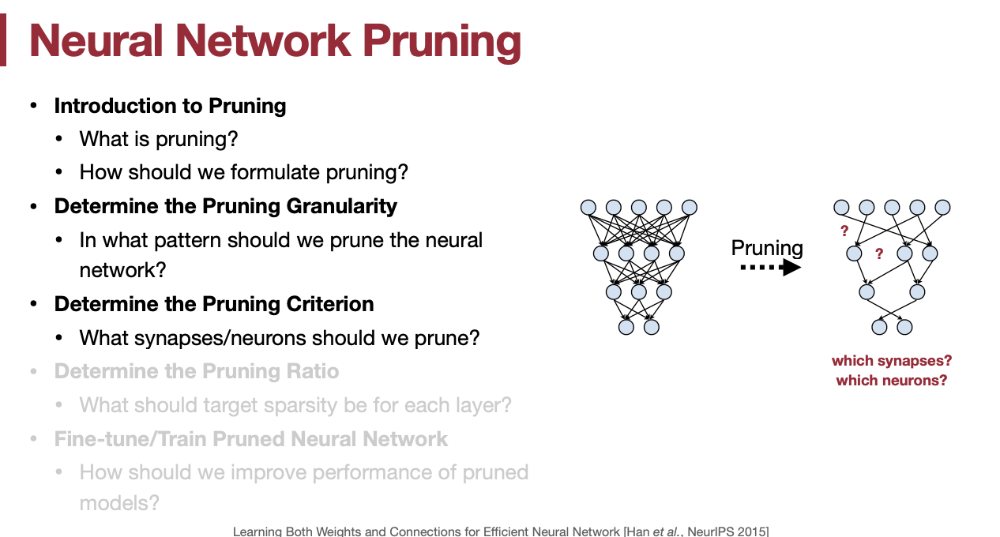
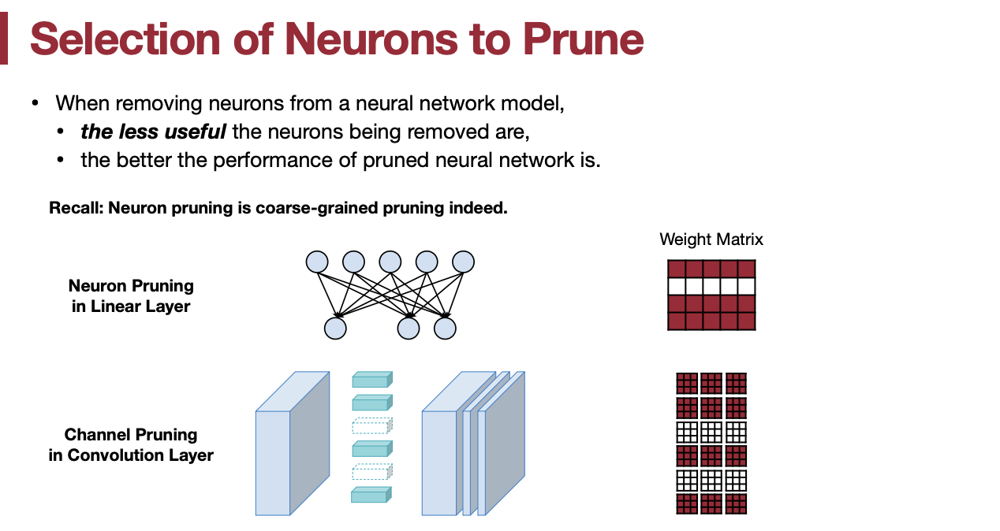

## Lecture 03: Pruning and Sparsity (Part I)

| Title       | Introduction to TinyML and Efficient Deep Learning Computing |
| ----------- | ------------------------------------------------------------ |
| Lecturer    | Song Han                                                     |
| Date        | 09/15/2022                                                   |
| Note Author | Andrew Feldman (abf149)                                      |
| Description | Introduce and motivate pruning; outline the pruning process and granularities; overview pruning criteria |

[TOC]

### 1. 课程大纲

- 介绍神经网络剪枝
- 剪枝过程
- 剪枝粒度
- 剪枝标准

### 2. 神经网络剪枝简介

#### 2.1 运行 DNN 的成本背景

* 增加存储大型模型的内存成本
    * 乘法/累加是 DNN中的主要计算操作；主存储器访问能量超过算法成本约 200 倍

- 模型整变得更大

- 将模型从主存移动到 on-chip memory hierarchy & arithmetic units 的成本正在增加

##### 2.1.1 关键的 DNN 运行代价指标

- 模型大小：权重参数的数量，它直接影响存储大小，间接影响传输模型所涉及的带宽和延迟。
    - 内存成本的增加和模型大小的增加意味着存储成本是最小化模型大小的关键原因
    - 构建支持更高带宽的内存的成本也更高，随着模型扩展到具有更多权重，在处理器内存层次结构（主内存、缓存、寄存器文件）中移动权重块所需的带宽也会增加。这也促使模型尺寸最小化
    - 将 DNN 下载到移动设备上是模型大小影响的另一点；大的模型意味着能够通过移动数据快速下载 DNN 模型与花费很长时间传输模型和/或需要 WiFi 之间的差异
        - 示例：1000 万的权重可能太大，无法存储在手机上或方便地传输到手机上模型，特别是通过蜂窝数据
- 模型运行时间
    - 执行时间相对于模型大小的缩放行为是包括神经网络的算术运算的函数
- 模型推理能耗
    - 示例：用于蛋白质折叠、游戏等的大型 RL 策略 DNN 可能消耗数千美元的 GPU 或 TPU 时间

#### 2.2 稀疏性背景

- 稀疏性通常指包含多个值的数据结构中潜在的统计冗余。通常，稀疏性意味着有机会通过省略冗余来“压缩”数据结构。
- 在本课中，我们主要关注利用最平凡的稀疏形式（想想：冗余），即数据结构中零值的子集。
- 在这个类中，我们关心的数据结构是张量

### 3. 什么是剪枝

剪枝——比喻为“大脑损伤”；或者换句话说，消除不必要的知识。DNN 的知识被理解为存在于其“权重”中。

事实证明，许多（不是最具工业意义的）DNN 模型可以分解为其组件的权重张量，并且组件的权重张量通常包含统计冗余（稀疏性）-因此，你应该能够压缩 DNN 的组件张量，从而缩减 DNN 的存储、数据传输和执行时间/能量成本。想象一下，将每个 DNN 张量放入一个 “zip文件”，它比原始文件需要更少的比特。

存在许多压缩技术，这些技术通过从张量中删除冗余零值来工作，使得压缩后的大部分或所有剩余值都是非零的。通常，使用这种去零方案可以直接对压缩数据进行计算，因为我们对 DNN 感兴趣的计算是乘法/累加的，因此零操作数是无效的。

然而，在许多工业上有趣的 DNN 中，稀疏性并不直接采取冗余零值的形式，而是表现为权重张量中的其他隐藏模式。这导致了“剪枝”的想法——假设张量具有某种潜在的统计稀疏性，我们使用某种技术将这种稀疏性转换为零稀疏性。我们将一些 DNN 权重翻转为零，并可能调整其他权重的值以进行补偿。由于零值权重对乘法/累加无效，我们将零值权重视为不存在（它们被“删减”），因此我们不会存储、传输或计算这些权重。总之，我们通过将基础统计稀疏性转换为特定形式的稀疏性（零稀疏性），然后依靠硬件和/或软件来“利用”这种稀疏性，从而减少工作量，从而节省关键指标。

#### 3.1 通过神经生物学类比引入剪枝

在神经生物学中，轴突连接被理解为在表示和计算大脑中的信息方面发挥作用。轴突连接的数量在出生后急剧增加，在一段时间内保持高水平，直到最终在青春期结束和成年时，大量连接被破坏。科学家认为，大脑这样做是为了在生命早期促进积极的学习，然后在生命后期只学习最关键的知识。破坏轴突连接的后一阶段在神经生物学中被称为神经元轴突的“修剪”。

将张量稀疏性表示为冗余零权重，然后避免在这些零权重上做工作的过程被称为“剪枝”，这与人类发展中轴突破坏的后期类似，因为零权重已经被有效地从考虑中移除，任何剩余的 DNN 知识都必须封装在剩余的少量非零权重中。

有时，DNN 在修剪之前被训练完成（预训练），在这种情况下，神经生物学的类比更为适用-模型的初始预训练就像婴儿和儿童阶段的攻击性学习，之后需要修剪，以仅保留“成年”最重要的知识。

#### 3.2 恢复剪枝精度

- 即使在显著的修剪因子下，DNN的 准确性通常也可以被保持，这是因为在修剪之前存在潜在的权重冗余
    - 示例：NeuralTalk LSTM 保持图像字幕质量高达 90% 的修剪因子
    - 但准确度最终会下降，在某个临界准确度水平附近急剧下降

#### 3.3 工业界支持

- 工业界剪枝工具
    - AMD/Xilinx
    - Xilinx Vitis
        - 将模型复杂性降低 5 到 50 倍，精度影响最小
- 利用稀疏性的关键架构
    - 学术界
        - EIE [Han et. al., ISCA 2016]
        - ESE [Han et. al., FPGA 2017]
        - SpArch [Zhang et. al., HPCA 2020]
        - SpAtten [Wang et. al., HPCA 2021]
    - 工业界
        - NVIDIA 安培架构
            - 2:4 sparsity in A100 GPU, 2x peak performance, 1.5x measured BERT speedup

### 4. 剪枝过程

定义剪枝问题（没有权重更新/重新训练/微调，稍后将讨论）

#### 4.1 剪枝步骤

- 高级视角
    1. 持续训练 — 梯度下降/SGD
    1. 修剪连接 — 如上所述
    3. 权重 — 更新/训练/重新训练/微调-使用梯度下降/SGD过程以及将修剪后的权重保持为零的掩码，以调整*剩余* 权重并恢复准确性
        - 参见 "权重更新和迭代剪枝" 小节
- 额外事项
    - 选择要修剪的特定权重或权重组
    - 权重变成 0
    - 可以从计算中完全跳过零权重⇒ 节约时间、钱以及能耗
    - 无需存储零权重⇒ 存储和数据传输节省
    - 所有入口权重为零的神经元本身可以被修剪⇒ 删除该神经元的所有出口权重⇒ 额外的执行和存储节省

#### 4.2 权重更新和迭代剪枝

- 修剪的“大脑损伤”→ 修剪后精度降低（“恢复精度”）
- 恢复的准确性可以通过更新权重来提高，以适应大脑损伤
- 我们还通过以稀疏因子的小增量增量修剪模型来提高精度

##### 4.2.1 修剪、权重更新和迭代的影响

- 这里，我们假设使用基于幅度的修剪的变体，但不管怎样，想法都是相似的
- 修剪过程的每个步骤对权重分布都有显著的影响
- 在没有其他先验知识的情况下，假设初始权重分布类似高斯分布
- 修剪会去除绝对值接近于零的权重，从而留下高于和低于零的权重值的双峰分布
- 重新训练/微调/权重更新增加了这些分布的传播，这是因为通过调整权重来恢复准确性（即纠正大脑损伤）

- 修剪会牺牲准确性，而稀疏因子的严重性会增加
- 精度/稀疏度趋势是一个相对平缓的斜率
- 重新训练/微调/权重更新恢复准确性；在一定的稀疏度下，精度会突然下降
- 加入迭代训练可以恢复最大的精度并保持最均匀的精度，在非常高的稀疏系数下，几乎没有砖墙的精度下降
- 注意，实际上，通过积极修剪，准确度略有提高，我们可能会假设这是由于避免过度拟合

### 5. 粒度

- Fine-grained (a.k.a. 非结构) 剪枝
    - 灵活的修剪索引
        - 本质上是“随机访问”，以删除任何张量中的任何权重
    - 优点：高恢复精度/相同精度的更高压缩比；这是灵活性的结果，以匹配权重张量中冗余的基本模式
    - 缺点：在定制硬件中开发的潜力；在 CPU/GPU 上有效利用具有挑战性或不可能
- 基于模式的剪枝
    - 将修剪索引约束为固定模式，以便硬件更容易利用稀疏性
    - 一个经典的例子是 N:M 块修剪-在每个大小为 M 的连续权重块中，N 必须为非零
    - 优点：更易于在硬件中利用；NVIDIA Ampere GPU 架构利用的 2:4 块稀疏性；大约 2 倍加速
    - 缺点：由于灵活性较低，与细粒度相比，恢复精度/压缩比较低；在 CPU 上有效利用可能具有挑战性
- 在细粒度和通道修剪之间有许多中间的修剪粒度，这一点很快就会提到：
    - 向量级的剪枝
    - kernel 级的剪枝
- 通道级剪枝
    - 粗粒度修剪约束-仅删除整个通道，有效更改层几何结构
    - 优点：可在 CPU 和 GPU 上进行开发（有效地改变了层几何结构）；也可以在自定义硬件中利用
    - 缺点：由于几乎没有任何灵活性，恢复精度/压缩比最低

### 6. 权重剪枝标准

#### 6.1 幅度修剪-修剪最小权重值

$$
\text{Importance} = |W|
$$

也称为“显著性”。首先修剪最低重要性权重。这是一个启发式得分。

* 对于细粒度修剪，基于上述重要性得分的个体权重排名将与基于任何范数（L1、L2等）的排名相同

- 对于其他修剪粒度，有必要区分用于聚集权重组重要性的公式

    - L1-norm : $\sum_{i\in S} |w_{i}|$

    - L2-norm : $\sqrt{\sum_{i\in S} |w_{i}|^{2}}$
    - Lp-norm：$(\sum_{i\in S} |w_{i}|^{p})^{\frac{1}{p}}$

#### 6.2 Scaling-based pruning

输出通道（滤波器）被分配为可训练*通道比例因子*；采用信道缩放因子的大小排序来修剪信道

- 对于批次范数之前的 Conv 层，批次范数的集成比例因子可用于幅度修剪

#### 6.3 基于泰勒级数的剪枝标准

- 使用网络损失加权值的泰勒级数作为权重重要性/显著性的代理
- 权重的去除被建模为其值降至零，这会根据泰勒级数导致损失的增量变化 $\delta L$
- 不同的泰勒级数术语提供了不同的信息，将在下一节中讨论

##### 6.3.1 二阶方法

最佳脑损伤（OBD）（Yan LeCun）— 早期二阶信息修剪

- 假设预先培训的网络 ⇒ 一阶项 ~0，二阶项是损失加权的 Hessian 函数，并假设 iid 去除导数交叉项：$importance_{w_{i}} = \frac{1}{2}h_{ii}w^{2}_{i}$
- 优点：有效地“一次性”计算要修剪的权重 & 如何调整剩余权重以进行修剪
- 缺点：
    - 通常，基于 Hessian 尺寸的二阶信息为 (#权重)^2⇒ 无法计算和存储；
    - OBD 假设对角 Hessian 权重，即 iid 权重，因此只有自二阶导数是非零的，然而随后的最佳脑外科医生论文（OBS）根据经验表明，这种近似经常不准确，这对恢复的准确性有负面影响
    - 此外，使用 Hessian 的修剪结果的“一次性”计算寻求原始训练局部最小值的最近解；不太可能逃脱局部极小值

##### 6.3.2 一阶方法

- 假设二阶项可以忽略，并假设 iid，因此对于 fine-grained 剪枝 $\text{importance}_{w_{i}} = (g_{i}w_{i})^{2}$，对于 coarse-grained 剪枝 $\text{importance}_{\textbf{W}^{S}} = \sum_{i\in S} |\delta L_{i}|^{2} = \sum_{i\in S} (g_{i}w_{i})^{2}$

### 7. 神经元剪枝

作为一般规则，“当从网络中删除神经元时，被删除的神经元越不有用，被修剪的神经网络的性能越好。”

#### 7.1 Percentage-of-zero-based pruning

从具有最高平均零激活百分比（APoZ）的模型中移除神经元

#### 7.2 基于一阶的剪枝

另一个基于泰勒级数的技术。

#### 7.3 基于回归的剪枝

在每个层定义 MSE 损失函数，然后进行粗粒度或细粒度修剪，以最小化对层 MSE 的影响。
- 两个步骤：
    - 固定权重值，求解要修剪的通道（*NP 难）
    - 修复信道修剪选择，解决权重更新，以最大化恢复精度/最小化重建误差

## Lecture 03 - Pruning and Sparsity (Part I)

<table>
    <tr>
        <td >

</td>
        <td >

</td>
    </tr>
</table>

在本次讲座中我们将学习剪枝和稀疏性，这是高效深度学习的一项非常基本的技术。

在本次讲座中我们将首先介绍神经网络剪枝，它有时可以减少神经网络中的参数数量，甚至可以将参数数量减少 90%，只保留 10% 的参数；我们如何恢复原来的精度以及我们应该删除哪些参数或者我们应该保留哪些参数？我们将学习这些技术以提高计算效率，因为我们将拥有一个更小的模型，更少的内存移动和更有效的推理。我们将经历不同的修剪步骤，它将引入不同的修剪粒度、神经网络修剪的不同标准。

<table>
    <tr>
        <td >

</td>
        <td >

</td>
    </tr>
</table>

首先是今天的人工智能变得超级大，这些是 NLP 模型的大小，近年来呈指数增长，模型的大小基本上是网络中参数的数量。

另一个重要的概念是访问内存比计算要昂贵得多，更多的数据移动意味着我们需要更多的内存访问，更多的能耗。

所以我们想要使内存移动尽可能少，为了做到这一点：

* 从算法的角度：减少模型大小、减少激活大小、减少工作量
* 从系统的角度：构建更高效的硬件、更好的编译器、更好的调度策略、更多的缓存等

这些是本讲座中的两种方法，我们将学习第一种方法，从算法的角度来看，我们如何从根本上减少数据移动的要求，如果对硬件方法感兴趣，我们将在下学期开设硬件深度学习课程，这是对今天讲座的一个很好的补充。

<table>
    <tr>
        <td >

</td>
        <td >

</td>
    </tr>
</table>

这就是今天的议程，让我们从什么是剪枝开始。

剪枝自然的发生在人脑中，小时候少，2~4 岁多，后面逐渐减少。

<table>
    <tr>
        <td >

</td>
        <td >

</td>
    </tr>
</table>

通过移除一些突触或神经元来使神经网络更小，这样就可以使一个密集的神经网络变成一个稀疏神经网络。

我们将如何进行剪枝？我们首先训练模型到收敛，其次必须要识别哪个神经元重要，哪个神经元不重要

<table>
    <tr>
        <td >

</td>
        <td >

</td>
    </tr>
</table>

假设这条虚线是正确的基线精度，然后我们将修剪掉一些连接，我们修剪得越多，精度损失的越多，当裁剪 80% 的参数时，准确度下降非常显着，下降了 4.5 个点。当裁剪 50% 时，精度下降不到 0.1%。在底部图上，是修剪前后的权重分布，在修剪之前它大致为这个特定层的权重形成的一个正态分布，修剪后我们将删除那些值较小的参数，可以删除低于阈值的一些参数，达到剪枝的目的，你可以想象我们删除的越多，精度差距就越大，因为修剪了更多的参数。

> 对于图中的正态分布图，约靠近中间位置的值约接近于 0，即很小的值，删掉后就变成了两个山尖

我们如何恢复准确度？我们可以训练剩余的权重，虽然我们剪掉了 80% 的参数，但你仍然有 20% 的参数可以训练，因为它们已经几乎收敛，需要使用较小的学习率继续训练。我们发现可以通过那  20% 的参数来恢复准确度，并达到几乎没有准确度损失，这非常好。重新训练后的权重分布仍然大致遵循这个趋势，但是变得更柔和、更平滑，因为我们正在重新训练这些权重。

<table>
    <tr>
        <td >

</td>
        <td >

</td>
    </tr>
</table>

这不是极限，我们可以证明裁剪超过 80%，**我们可以正确地迭代这个过程，剪枝完后重新训练，训练完后再剪枝，通过迭代地进行这样的修剪和重新训练**，实际上我们可以删除 90% 的 AlexNet 而不会损失任何精度，这非常好，之后准确率开始很快下降。**这是剪枝过程的指导思想**。

我训练了 AlexNet、VGG、 GoogleNet、ResNet50、SqueezeNet，剪枝之前，这些网络的参数量从 6000 万到 100 万不等，SqueezeNet 是一个超级紧凑的超级小神经网路，我在攻读博士学位期间与 berkeley 合作设计的，它只有 100 万数量的参数，而 AlexNet 有 6100 万个参数，修剪后它只有 670 万个，因此减少了 9 倍，计算量可以减少三倍。

为什么 MACs 减少的数量与参数数量的减少不同，我们有不同的计算，在上一课中我们描述了如何计算参数量与 MACs，卷积层的参数量 = 内核大小 x 内核大小 x 输入通道 x 输出通道，对于 MACs，它是六个项的乘法，输出分辨率的高 x 输出分辨率的宽 x 输出通道 x 核的高 x 核的宽 x 输入通道，所以它们有不同的计算，因此权重数量的减少与 MACs 数量的减少不同。

压缩后的 VGG 仅有大约 1000 万参数，减少 12 倍，所以这个模型最初要大得多，你可以想象它与 Alxnet 相比也有更大的压缩比。

GoogleNet 出现在这些模型之后，最初是更紧凑，它有 7M 个参数，所以即使每个参数使用 4 字节 32 位浮点数，也只有 28M 字节，修剪后它只有 2M 的参数量，所以减少了大约 3.5 倍参数量。

ResNet 非常流行，它有 26M 参数，压缩后减少 3 倍。

这里常见的观察是对于这些由完全由卷积层构建的神经网络，它们没有 FC 层，因此冗余较少，对于 AlexNet 和 VGG，它们都有一个非常庞大的全连接层，占据了大量的参数，所以**当你为这些微控制器或这些移动设备设计紧凑的网络时，我们应该避免这种情况，应该尝试使用这些完全卷积神经网络，然后再使用这些模型压缩技术**。

令人兴奋的是 SqueezeNet，当我在读博士的第四年时，它只有一百万个参数，所以我们在想，它已经超级紧凑了，但这不是极限，我们可以进一步修剪它来减少它，所以我开始了实验，实际上这个神经网络也是可压缩的，没有损失任何准确性，我们将参数从 100 万减少到只有 380 k，在不损失任何精度的情况下大约减少了 3 倍，这非常令人兴奋。

因此在本讲座的后面部分，我们**将讨论如何设计这些高效的架构，然后使用这些模型压缩技术进一步压缩它，这就是现在被广泛采用的流程。先设计类似于 SequeezeNet 这种小型紧凑神经网络，然后修剪、量化压缩这些小型神经网络，这是一个很好的实践。**

<table>
    <tr>
        <td >

</td>
        <td >

</td>
    </tr>
</table>

这是 NeuralTalk 的例子，图像说明基本上是首先对图像进行特征提取，然后你得到这个图像的向量嵌入，将这个向量嵌入提供给 LSTM，然后生成一个句子来描述图像中发生的事情，这就是所谓的图像捕获。

这个基线模型是我制作的完整神经网络，例如这个预测说“一个穿着白色制服的篮球运动员正在打球”，它非常准确，在修剪了 90% 个参数后，它说“一个穿着白色制服的篮球运动员正在打篮球”，我觉得它比仅仅说打球更准确，当你修剪掉适量的参数时，可以从原始图像中提取更好的特征。

第二个例子，一个 field，一个 area，几乎是一样的，“一只棕色的狗正在草地上奔跑”

第三个例子，“一个人正在在浪上冲浪” vs “一个穿着潜水衣的人在海滩上乘风破浪”

但我们不能修剪得太过激进，最后一张图片原始模式说 "一名穿红色衣服的足球运动员正在赛场上奔跑"，而修剪后的版本说，"一名身穿红色衬衫和黑白黑色衬衫的男子正在穿过田野"，它有点喝醉了，所以这意味着我们不要过于激进地修剪，这会伤害神经网络的性能。

你可以看到这种方法近年来变得非常流行，这是近些年网络剪枝方面论文的发表量趋势。

<table>
    <tr>
        <td >

</td>
        <td >

</td>
    </tr>
</table>

现在硬件支持 2:4 稀疏度，即四个参数中有两个必须为零，将稠密矩阵变成稀疏矩阵，我们将更深入地介绍它，它可以在 NVIIDIA Ampere GPU 上将性能提高多达 2 倍，它引入了一个 A100 稀疏优化的张量核，以便能够测量加速，它实际上是在不损失任何准确性的情况下，可以加速 BERT 1.5 倍。

> 参考资料：
>
> 	* 英伟达安培架构：https://www.nvidia.com/en-us/data-center/ampere-architecture/
> 	* 英伟达团队李曦鹏知乎问答：https://www.zhihu.com/question/394863138/answer/1275510947
>
> * Paper：[Accelerating Sparse Deep Neural Networks](https://arxiv.org/pdf/2104.08378.pdf)  第 3、4 章节
> * github: [ASP](https://github.com/NVIDIA/apex/tree/e2083df5eb96643c61613b9df48dd4eea6b07690/apex/contrib/sparsity)
> * 简书博客：[NVIDIA Ampere 架构：细粒度结构化稀疏性](https://www.jianshu.com/p/80de36aa840c)

左边这里有一些加速稀疏和压缩神经网络的论文，这是我的博士论文的一部分，我们可以直接加速这些稀疏和压缩硬件中的神经网络，无需解压缩。

> 参考资料：
>
> * EIE：[EIE: Efficient Inference Engine on Compressed Deep Neural Network](https://arxiv.org/abs/1602.01528)
> * ESE：[ESE: Efficient Speech Recognition Engine with Sparse LSTM on FPGA](https://www.comp.nus.edu.sg/~hebs/course/cs6284/papers/han-fpga17.pdf)
> * SpArch：[SpArch: Efficient Architecture for Sparse Matrix Multiplication](https://arxiv.org/abs/2002.08947)
> * SpAtten：[Efficient Natural Language Processing](https://spatten.mit.edu/)

这个方法也是 RPG 公司签约采用的一部分，他们可以将模型复杂度降低 5 到 50 倍，对准确性的影响最小，你可以通过这个签约使用这个 AI 工具包，它现在是 AMD 的一部分，可以在使用 PFGA 加速之前运行以压缩模型。

> 参考资料：
>
> * [Vitis AI 用户指南 (UG1414)](https://docs.xilinx.com/r/zh-CN/ug1414-vitis-ai/Vitis-AI-%E4%BC%98%E5%8C%96%E5%99%A8)
>
> * [Vitis AI 优化器用户指南(UG1333)](https://docs.xilinx.com/r/zh-CN/ug1333-ai-optimizer/%E5%89%AA%E6%9E%9D)
>
> * FPGA是一种可以重构电路的芯片，是一种硬件可重构的体系结构。它的英文全称是Field Programmable Gate Array，中文名是现场可编程门阵列。
>
>     通过编程，用户可以随时改变它的应用场景，它可以模拟CPU、GPU等硬件的各种并行运算。通过与目标硬件的高速接口互联，FPGA可以完成目标硬件运行效率比较低的部分，从而在系统层面实现加速。

<table>
    <tr>
        <td >

</td>
        <td >

</td>
    </tr>
</table>

我们已经了解了修剪的一些基础知识。下面我们谈谈应该如何剪枝。

一般来说，当我们训练神经网络时，我们尝试通过对权重进行 sgd 来最小化损失函数，但是对于剪枝，我们有一个约束，我们必须限制非零参数的数量小于阈值。传统上我们只是训练权重，现在我们有一个新的约束，非零权重的数量必须小于阈值。

<table>
    <tr>
        <td >

</td>
        <td >

</td>
    </tr>
</table>

证明不同的剪枝粒度，如果你对并行硬件设计有一些基本的了解，现代 GPUs 或其他具有高热解的加速器，通常需要非常规律的计算。应该让它计算一大块像素而不是像单个像素，这样你就可以保持 GPU 利用率高而不挨饿。

所以我们可以修剪多少与是否更规则的修剪之间存在权衡，我们当然可以在没有任何规则的情况下修剪单个权重，或者我们可以修剪一些权重块，就像图中下面这种情况下，我们正在修剪整个 2 x 2 方格，这样得到的权重矩阵就有一些模式。

我们应该以什么样的模式来修剪这些神经网络，以及如何权衡可以修剪掉的权重数量与实际速度之间的关系。与专用硬件相比，在现成硬件上实现速度提升有多容易等。

接下来我们要讨论剪枝标准，有很多方式，有很多激活，所以我们应该保留哪个，我们应该删除哪个，以及剪枝率？

<table>
    <tr>
        <td >

</td>
        <td >

</td>
    </tr>
</table>

就像这个三层网络一样，我们应该修剪 30%、50% 还是 70%？我们应该证明多少才能平衡准确性与模型
大小？

最后我们如何微调剩余的参数，以恢复网络精度。

<table>
    <tr>
        <td >

</td>
        <td >

</td>
        <td >

</td>
    </tr>
</table>

让我们开始确定修剪粒度。然后讨论这种结构化剪枝与非结构化剪枝之间的权衡

左图，这是一个 2d 权重矩阵的示例，8 x 8 权重矩阵，最初都是密集的，现在我们修剪掉一些权重，修剪后呈白色，这是纯粹的非结构化修剪，根本没有任何模式，它非常灵活，因为我们可以修剪掉任何权重。

但是这很难在 GPU 上加速，因为这是非常不规则的，为了存储这个矩阵，你不仅要存储这些权重，还要使用 coo 格式存储它们的位置获取 x 和 y 索引或使用类似 csr、csc 格式表示，因此存在开销，但是使用专用硬件，你可以构建一个硬件加速器，直接运行在这个稀疏矩阵向量乘法上，例如，高效的推理引擎（EIE）是第一个可以在这种方法之后加速这种稀疏神经网络的。

> fine-grained：细粒度/非结构化剪枝，任何权重理论上都可以任意被裁剪；
>
> coo/csr/csc：是不同的稀疏矩阵存储方法，可参见 [scipy 文档](https://docs.scipy.org/doc/scipy/reference/sparse.html)，数据和索引分别存储，分别是按坐标、按行、按列的组织形式，初次理解起来有些费劲。

优点是，你可以完全灵活地决定修剪哪些权重，因此修剪率非常高，如果你的目标只是减小模型大小，这可能是一种非常有吸引力的方法。

右侧我们有其他方法，如 Coarse-grained 或结构化修剪，在这个例子中，我们整行的修剪，从原来的 8x8 修剪为 5x8，使用这种粗粒度或结构化修剪，减少 GPU 的实际计算，我们可以轻松地在这个现成的硬件上加速而不需要专门设计硬件加速器。但不灵活，它会损害准确性。

**前者（细粒度剪枝）容易修剪，微调修复快，但很难加速，后者（粗粒度剪枝）容易加速，但不容易恢复精度。**

<table>
    <tr>
        <td >

</td>
        <td >

</td>
    </tr>
</table>

术语回顾，参照上图。这 4 个维度为我们提供了更多选择来选择修剪粒度。

在这个例子中 $k_w$ 和 $k_h$ 都是 3，输入通道为 2， 输出通道是 3

<table>
    <tr>
        <td >

</td>
        <td >

</td>
    </tr>
</table>

我们可以从这种细粒度的修剪方法中获得各种不同的修剪粒度，由于任何权重都可以被修剪或不修剪，所以可能性的数量是 2 的元素数量次方；

或者我们可以像俄罗斯方块一样进行基于模式的剪枝，或基于向量级，kernel 级，或极端点基于 channel 级。

所以我们可以分析每个选择的优缺点，如果你想在手机上加速你的神经网络，你会选择哪一个？ 使用专门的加速器或在 cpu 上？

如果你有专门的硬件设计能力，你可以使用 fine-grained 方法，**但如果你只想像在手机 cpu 上加速，通道修剪是最好的方法。**

<table>
    <tr>
        <td >

</td>
        <td >

</td>
    </tr>
</table>

让我们研究一些情况，比如细粒度修剪我们已经展示了这些压缩比范围，从 3 到12 倍，它们通常具有更大的压缩比，因为我们可以灵活地找到“冗余”权重。

<table>
    <tr>
        <td >

</td>
        <td >

</td>
    </tr>
</table>

可以在一些定制硬件上提供一些交付速度，例如 EIE（Efficient Inference Engine），但在 GPU 上不是很容易。

然后我们有这种基于模式的剪枝，

<table>
    <tr>
        <td >

</td>
        <td >

</td>
    </tr>
</table>

N:M 稀疏，这意味着每 M 个元素需要剪枝掉 N 个，典型的是 2:4，如中间图所示，这是大约在 2020 年出现的，非常现代的技术，可用于 A100 或任何 Ampere GPUs。

我们可以将这个矩阵从八列压缩成只有四列，对于每个权重，我们只需要在索引中存储 2 bit 的位置索引就可以。

> 举个例子，例如左侧绿色矩阵的第一行为 [8,3,2,7,2,6,5,4]，前四个一组，后四个一组，分别裁掉值较小的，则最后剩下 [8,7,6,5]，紫色的索引第一行则要记录剩下的值在原始矩阵中的位置 [[0,3], [1,2]]，详见 Paper：[Accelerating Sparse Deep Neural Networks](https://arxiv.org/pdf/2104.08378.pdf)  第 3.1 章节

这里显示了不同神经网络、不同数据集的加速，包括 imagenet 分类、检测以及用于问答和机器翻译的 Transformers，因此准确性得到了很好的保持，例如 ResNet-50 稠密 FP16 最佳是 76.1，稀疏版本是 76.2，采用的是 NVIDIA Ampere 框架 和 TensorRT 加速。

> NVIDIA TensorRT™ 是用于高性能深度学习推理的 SDK。此 SDK 包含深度学习推理优化器和运行时环境，可为深度学习推理应用提供低延迟和高吞吐量。详见：https://developer.nvidia.com/zh-cn/tensorrt
>
> 测评原文 blog：[Accelerating Inference with Sparsity Using the NVIDIA Ampere Architecture and NVIDIA TensorRT](https://developer.nvidia.com/blog/accelerating-inference-with-sparsity-using-ampere-and-tensorrt/)

<table>
    <tr>
        <td >

</td>
        <td >

</td>
    </tr>
</table>

我们看看其他场景，如果你想测量手机上 cpu 的加速，这可能是当今最流行的场景，现成的硬件资源，这基本上是通道级修剪。

通道修剪基本上是修剪整个通道，比如之前你有 256 个输出通道，现在你可能只有200 个通道，从 cpu 的角度来看，你的工作量更少，如图所示。缺点是它具有较小的压缩比，裁剪的通道数大约从 10 到 30 到 50 的范围，而不是像 3x 或 10x 的裁剪

<table>
    <tr>
        <td >

</td>
        <td >

</td>
    </tr>
</table>

但是在相同的稀疏率情况下，这种裁剪方法比均匀的每层缩减要更好一些。在本讲座的后面部分将描述如何选择最佳稀疏度。

（学生问题的解答）我们可以在训练过程中强制执行这种稀疏性吗？答案是肯定的，实际上我们将引入正则化以及强制执行优先级的方法一个简单的方法就是添加 L2 或 L1正则化，以便鼓励在训练期间所有权重必须具有较小的值。

右图中，我们使用两种方法试验了实际延迟的加速，

在手机上使用相同的延迟测量，非均匀的剪枝可以获得更高的准确度，或者为了达到相同的准确度我们可以有更低的延迟，AMC（automl for model compression）这是个一键解决方案（one-button solution），输入一个神经网络，返回一个较小的神经网络。

> [AMC: AutoML for Model Compression and Acceleration on Mobile Devices](https://arxiv.org/pdf/1802.03494.pdf)，其核心思想是使用强化学习技术来实现自动化压缩模型。已开源，详见 https://github.com/mit-han-lab/amc

<table>
    <tr>
        <td >

</td>
        <td >

</td>
    </tr>
</table>

接下来，这里我们来确定应该使用什么参数？以及我们应该证明保留哪些神经元？

剪枝标准：我们应该修剪哪些突触和神经元？

<table>
    <tr>
        <td >

</td>
        <td >

</td>
    </tr>
</table>

这里举了个例子，在输入 X 进行归一化后，每个输入大概有相似的 L2 范数，很明显可以将 0.1 这个权重剪掉。该方法很简单，且有效。

简单的基于启发式的想法，基于值的绝对值大小进行裁剪，绝对值大的重要，小的不重要。这是一种细粒度的剪枝。

<table>
    <tr>
        <td >

</td>
        <td >

</td>
    </tr>
</table>

如果我们想做一些结构化的规则，进行明智的修剪，例如想证明裁剪整行，也是一样的计算方法，求和比较大小，裁掉总和较小的区域。

可以如上图选择 L1 方式，也可以如下图，选择 L2 范式，当然也可以是 p-范数

<table>
    <tr>
        <td >

</td>
        <td >

</td>
    </tr>
</table>

**这里是说，可以在每个卷积核后面乘上一个因子，达到剪枝的目的**，你可以对这些比例因子应用这些正则化，以便鼓励比例因子变小，在修剪时，我们只是用一个小的比例因子，就可以移除那些通道。在这种情况下我们移除滤波器 1和滤波器 2。

<table>
    <tr>
        <td >

</td>
        <td >

</td>
    </tr>
</table>

在修剪之前我们有 n 个滤波器，现在我们移除了两个滤波器，我们有 n-2 个滤波器。在这种情况下，这个是一种可训练的方法，可以鼓励一些通道更接近于零，这样我们就可以选择它们并将它们修剪掉。

上节课，我们介绍了 BN 层，你只需将你的激活减去平均值除以标准差，然后乘上缩放因子并加上 bias 即可，这个比例因子实际上可以被训练得更小，以确定通道缩放，因此你可以在 BN 层中的缩放因子上添加 L2 范数或 L1 范数，这不会为你添加任何额外的层或任何非常简单的开销。

这些都是基于量级的非常简单有效的方法。

<table>
    <tr>
        <td >

</td>
        <td >

</td>
    </tr>
</table>

还有其他方法，比如基于二阶的修剪方法，一个参数的重要性可以通过去除它所引起的误差来量化。根据泰勒展开式，泰勒展开系数基本上是一阶导数、二阶导数等，

> 泰勒展开式：
> $$
> f(x)=\frac{f\left(x_0\right)}{0 !}+\frac{f^{\prime}\left(x_0\right)}{1 !}\left(x-x_0\right)+\frac{f^{\prime \prime}\left(x_0\right)}{2 !}\left(x-x_0\right)^2+\ldots+\frac{f^{(n)}\left(x_0\right)}{n !}\left(x-x_0\right)^n+R_n(x)
> $$

最佳脑损伤论文，它假设

* 最后三阶项非常小，所以我们可以删除它们，

* 一阶项也可以忽略不计，因为神经网络训练基本上已经收敛，所以 一阶 g 接近于零
* 不同参数之间是独立的，所以交叉项也被忽略了，

所以我们只是将损失函数关于宽度修剪的变化近似为二阶导数

<table>
    <tr>
        <td >

</td>
        <td >

</td>
    </tr>
</table>

使用这个重要的分数，我们可以确定应该丢弃哪个权重，这是对角矩阵的二阶导数，Hessian 矩阵的对角线条目，$h_{ii}$ 乘以每个权重的平方，然后将它们相加。但是 Hessian 矩阵有点难以计算，它的计算量很大。

（右图开始，接下来三页有关一阶剪枝，讲座中没有提到，跳过了，与二阶类似）

<table>
    <tr>
        <td >

</td>
        <td >

</td>
    </tr>
</table>

<table>
    <tr>
        <td >

</td>
        <td >

</td>
    </tr>
</table>

回顾：神经元修剪实际上是粗粒度修剪。因为它会一次性去掉与它相连的所有权重。

上图言简意赅，展示了，线性层中的神经元剪枝的结果以及卷积层中的通道剪枝示意图。

这个图展示了基于 0 值的百分比进行剪枝，ReLU 激活的输出部分值会变成 0，

例如上图展示了 2 个 batch，各自 3 个通道的 4x4 大小的输出，例如在第一个 通道下，batch 中第一个样本（左侧第一个图）中含有 5 个 0，第二个样本（右侧第一个图）中含有 6 个 0，总的比例为 11/32，其他两个通道也是如此，最后发现第三个通道的 0 占比最高，裁剪掉。

**你可以随意使用我们的入门代码来探索不同的修剪标准。（[github](https://github.com/mit-han-lab/6s965-fall2022)）**

<table>
    <tr>
        <td >

</td>
        <td >

</td>
    </tr>
</table>

然后介绍另一种基于启发式回归的剪枝方法， 想象我们有一个 输入x权重=输出（上图），不考虑目标函数的修剪错误，基于回归的修剪试图最小化，我们尝试匹配的输出的重建错误，因为它只考虑中间层而不是整个网络，所以这是一种局部优化方式。

问题可以形式化表达为，如图所示，有上述两种方法可以求解。

（后面几页，讲座中没有细讲，公式化的内容比较多）

<table>
    <tr>
        <td >

</td>
        <td >

</td>
    </tr>
    <tr>
        <td >

</td>
        <td >

</td>
    </tr>
</table>

总结一下本讲座的内容，以及参考文献：

<table>
    <tr>
        <td >

</td>
        <td >

</td>
    </tr>
</table>

-----

截止到目前，主要介绍了什么是剪枝，剪枝的粒度以及剪枝的标准，

下一个讲座主要介绍剪枝的后续内容，每层的最佳剪枝率，如何训练/微调剪枝层，自动寻找最佳裁剪率，彩票假说、不同粒度的系统支持等

补充有关剪枝技术的额外参考资料：

* 吴建鑫 王环宇 张永顺等人合著 [结构化剪枝综述](https://cs.nju.edu.cn/wujx/paper/Pruning_Survey_MLA21.pdf)，主要对卷积和残差结构做了一些介绍
* Paper：*Pruning and quantization for deep neural network acceleration: A survey*  剪枝量化综述

